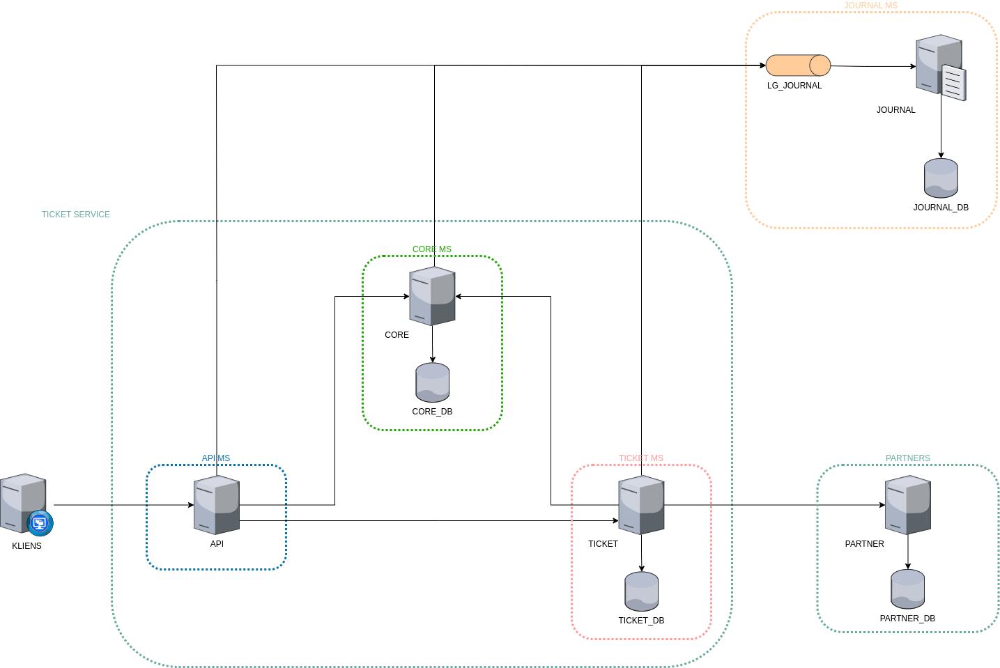

= Ticket Service

== Bevezetés

[.text-justify]
Ez a projekt egy komplexebb architektúra, csupán két featurét tartalmazó szimulációja.

== Infrastruktúra

== Főbb modulok

=== API modul *(main-api)*

[.text-justify]
A main-api modul nagyjából egy okos proxy alkalmazás, a felhasználók elől rejti el a többi, üzleti logikát megvalósító microservice-t.
Képes a kapott authentikációs token validálására a core-api modul segítségével, illetve képes továbbítani a kéréseket a megfelelő microservice-nek.

=== CORE modul *(core-api)*

[.text-justify]
A felhasználói adatokat tároló (és akár kezelésre is képes lenne egy kis továbbfejlesztéssel) modul, itt történik a felhasználó - bankkártya azonosítás és
ellenőrzés, illetve a teljes tranzakció lebonyolítása. Továbbá ez a modul felel a kommunikáció során használt user token validációra, mely nagy forgalma miatt
átgondolandó ennek a funkciónak a kiemelése külön MS-be.

=== TICKET modul *(ticket-api)*

[.text-justify]
Ez a modul valósítja meg a központot a jegy foglalás feature-ben. Ide futnak be a foglálsi igények, ez a modul hívja meg a core-api-t a fizetési művelet
lebonyolítása céljából, majd sikeres fizetés esetén elküldi a foglalási igényt a Partnernek. A szabad jegy ellenőrzési logikájának egy része a partner-api-ban
kapott helyett. A foglalás során a egy tranzakció ID generálódik, mely összefogja a core és a ticket modulok közötti logikailag egybe tartozó műveleteket.

A ticket-api a main-api-val analóg módon végzi a header-ben utazó token validálását.

== Partnerek

=== Partner modul *(partner-api)*

[.text-justify]
A partner-api a fiktív partnert "valósítja meg". Egyes, a jegy foglaláshoz kapcsolódó logikák itt találhatóak meg.
Tartalmaz egy zátornyra futott security configot, melynek célja a feladat kiírásban ismertetett ticket-api azonosítására szolgált volna. Az elakadást az okozta,
hogy a projekt Spring Boot 3 alapokra épült, melyben már deprecated-ek azok a beállítási lehetőségek, melyeket v3-nál korábbi verzióknál még használhatók voltak.

== Technikai részletek

[.text-justify]
A projekt egy monorepo felépítést kapott, melynek előnye (és egyben hátra), hogy a kapcsolódó összes modul, api, config, dokumentáció egy repositoryban található.

[.text-justify]
Az api-k közötti kommunikációja OpenAPI leíró segítségével valósul meg, egy Maven plugin generál klienst a leíróból, melyet a többi api tud használni. A generálás a 'generate-sources' fázisban történik, így Maven build esetén nincs egyéb teendő. Interface vltozás esetén a kapcsolódó *-api-client modulban szükséges frissíteni a swagger.json állományt, majd Maven buildet kell indítani, ezután használhatóak az új elemek.

[.text-justify]
Fejlesztés során integration tesztek írás is tervben volt, azonban probléma merült fel a Spring context felhúzása és a MockBean-ek injektálása során, így ezek megrekedtek. Az IT teszteket elősegítendő kerültek bevezetésre a gateway osztályok. A Clean Architecture-ben is javasolt a gateway-ek használata, mely más projektekben már (számomra) bizonyított, hogy nagyon hasznos tud lenni (pl mockolt "memory store" vagy valós DB használata, valós DB-k közötti váltás).

[.text-justify]
Ami még felmerült az érzékeny adatok (bankkártya száma, CVC szám, token) tárolása miatt, hogy az adatbázisba ne clear text-ként kerüljenek tárolásra az adatok. Ezt egyszerűen meg lehetne valósítani a JPA segítségével, egyszerűen az adott field-et kell felannotálni a converterrel, a többit a JPA elvégzi. Alább egy másik projektből látható kódrészlet található. (nem került beemelésre, mert egy saját modulomat is be kellett volna szervezni a projekt alá)

Entitás:

[source,java]
----
@Entity
@Table("TICKET")
public class Ticket {

    ...

    @Column(name = "WINNING_NUMBERS")
    @Convert(converter = NumberConverter.class)
    protected List<List<Integer>> winningNumbers;

    ...
}
----

Converter:

[source,java]
----

@Converter
public class NumberConverter implements AttributeConverter<List<List<Integer>>, String> {

    @Setter
    private static Encryptor encryptor; // ez a függőség érkezne saját modulból

    @Setter
    private static Decryptor decryptor; // ez a függőség érkezne saját modulból

    @Override
    public String convertToDatabaseColumn(List<List<Integer>> attribute) {
        return encryptor.encrypt(attribute);
    }

    @Override
    public List<List<Integer>> convertToEntityAttribute(String dbData) {
        if (isBlank(dbData)) {
            return null;
        }
        return decryptor.decrypt(dbData;
    }
}
----

Spring initializer:

[source,java]
----
@Component
public class EncryptionInitializer implements InitializingBean {

    private final String applicationKey;

    private final String salt;

    private final String parameterSpec;

    @Autowired
    public EncryptionInitializer(@Value("${secret.app_key}") String applicationKey,
                                 @Value("${secret.salt}") String salt,
                                 @Value("${secret.param_spec}") String parameterSpec) {
        this.applicationKey = applicationKey;
        this.salt = salt;
        this.parameterSpec = parameterSpec;
    }

    @Override
    public void afterPropertiesSet() throws Exception {
        byte[] paramSpecAsByte = parameterSpec.getBytes(ENCODING);
        Encryptor encryptor = new Encryptor(ENCODING, applicationKey, salt, paramSpecAsByte);
        Decryptor decryptor = new Decryptor(ENCODING, applicationKey, salt, paramSpecAsByte);
        NumberConverter.setEncryptor(encryptor);
        NumberConverter.setDecryptor(decryptor);
    }
}
----