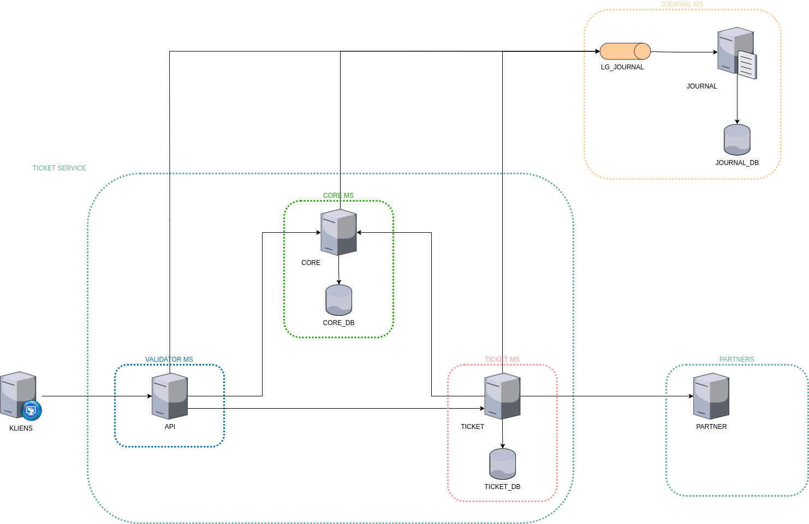

= Ticket Service

== Bevezetés

[.text-justify]
TODO

== Infrastruktúra

== Főbb modulok

=== API modul *(API)*

[.text-justify]
TODO: API leírás

=== CORE modul *(CORE)*

==== Feladatai

TODO: CORE leírás

=== TICKET modul *(TICKET)*

==== Feladatai

TODO: TICKET leírás

== Partnerek

=== Budapest Park *(PARTNER)*

==== Feladatai

TODO: PARTNER leírás